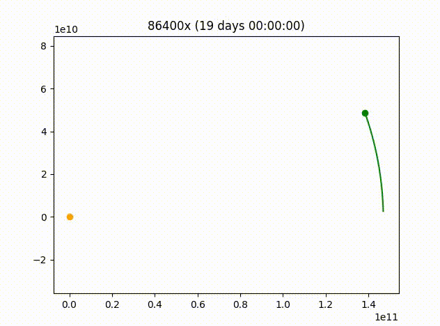
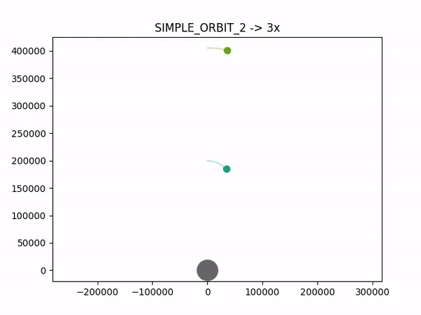
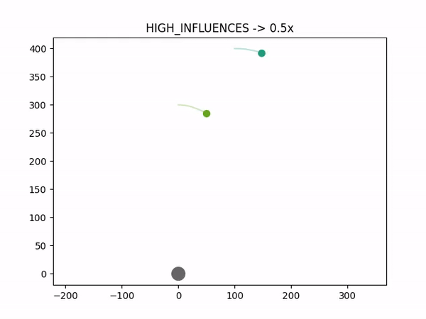
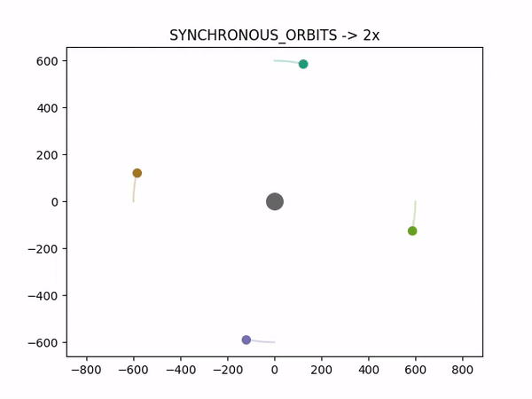

# Orbit Simulator
This project aims to simulate how orbital mechanics work

## Examples
<table cellspacing="0" cellpadding="0">
  <tr>
    <td></td>
    <td></td>
    <td></td>
    <td></td>
  </tr>
  <tr>
    <td>Simple orbit</td>
    <td>Simple orbit with 2 planets</td>
    <td>Orbit with 2 massive objects too close</td>
    <td>Synchronous orbit of 4 planets with different apogee locations</td>
  </tr>
  
</table><br><br>
<table cellspacing="0" cellpadding="0">
  <tr>
    <td ></td>
  </tr>
  <tr>
    <td>3D animation of 3 planets in orbit</td>
  </tr>
</table><br><br>

## Execution
```
usage: orbit_simulator [-h] [-mp PATH_SIZE] [-p] [-d] [-tw TIME_WARP]
                       [-ei EXTRA_ITERATIONS] [-fps FPS] [-3d]
                       {SIMPLE_ORBIT,SIMPLE_ORBIT_2,SIMPLE_ORBIT_3,HIGH_INFLUENCES,SYNCHRONOUS_ORBITS,SOLAR_SYSTEM}

positional arguments:
  {SIMPLE_ORBIT,SIMPLE_ORBIT_2,SIMPLE_ORBIT_3,HIGH_INFLUENCES,SYNCHRONOUS_ORBITS,SOLAR_SYSTEM}
                        Simulation preset name

options:
  -h, --help            show this help message and exit
  -mp PATH_SIZE, --path-size PATH_SIZE
                        Maximum amount of path coordinates
  -p, --no-pathes       Disable path drawing
  -d, --direction       Allow direction drawing
  -tw TIME_WARP, --time-warp TIME_WARP
                        Sets time warp
  -ei EXTRA_ITERATIONS, --extra-iterations EXTRA_ITERATIONS
                        Extra interaction per loop. Increases precision.
                        Decreases performance
  -fps FPS, --fps FPS   Sets the frame rate. Decreases performance
  -3d, --3d             Force 3d rendering

```
### Execution Command Example
Run preset ```SYNCHRONOUS_ORBITS``` at 3x time warp, 60 FPS, and force 3d rendering
```
python3 orbit_simulator synchronous_orbits -tw 3 -fps 60 -3d
```

## Measurement Units
Planet mass: $kg$<br>
Distance: $m$<br>
Speed & Velocity: $m/s$<br><br>

## Assumptions and Formulas

### Gravitational Constant
This is an aproximate value of $G$ based on Committee on Data for Science and Technology (CODATA) with the article "[CODATA recommended values of the fundamental physical constants: 2018](https://journals.aps.org/rmp/abstract/10.1103/RevModPhys.93.025010)". By Eite Tiesinga, Peter J. Mohr, David B. Newell, and Barry N. Taylor:<br>
$G= 6.6743 \times 10^{−11} m^3 kg^{−1} s^{−2}$<br><br>

### Distance between celestial bodies
In a 2d matrix, celestial bodies have $x$ and $y$ coordinates. The formula obtains the distance between the axes of the 2 celestial bodies by interpreting it as a right triangle, resulting in the value of the hypotenuse, in meters.

$\sqrt{|x_1-x_2|^{2}+|y_1-y_2|^{2}}$<br>

And for a 3d matrix, you simply need to add the $z$ axis to the formula

$\sqrt{|x_1-x_2|^{2}+|y_1-y_2|^{2}+|z_1-z_2|^{2}}$<br><br>

### Gravitational Acceleration
To calculate the gravitational acceleration I decided to use Newton's universal gravitational law, since it's simpler and works well for the scenarios addressed by the simulator (Stars, planets, ships and natural or artificial satellites)

$G$ = Gravitational Constant<br>
$M$ = Mass of the celestial bodies<br>
$r$ = Distance between the celestial bodies<br><br>

$F=G{M_1M_2\over r^2}$<br>
Using that equation, and considering that $F=g*M$, we can also directly calculate $g$ by the following formula:

$g={G{M_1M_2\over r^2}\over M_2}={G{M_1\cancel{M_2}\over r^2}\over \cancel{M_2}}=G{{M_1} \over r^{2}}={G\over 1}*{M_1\over r^2}$

Therefore,
$g = {{GM} \over r^{2}} $<br><br>

### Speed distribution between axes
Imagine you have a celestial body on the following XY coordinates: $[10, 5]$.

That means the distance from the $[0, 0]$ is $d=\sqrt{10^2+5^2}\approx11.18$.

That also means that  $[10, 5]\over 11.18$ retuns a rotation matrix (with values between -1 and 1) directing precisely the speed distribution ratio we need to use $[0.89, 0.44]$.

Now let's take into consideration that the speed of the celestial body is $2m/s$. After 1 second, the new distance should be $9.18$, right?

The approximate distance it should move on each axis after 1 second is then $[0.89, 0.44] * 2 = [1.78, 0.88]$

These are the distances we should substract from the coordinates, resulting into new coordinates of $[8.21, 4.10]$.
Using these coordinates, the new distance is $d=\sqrt{8.22^2+4.10^2}\approx9.18$

The simulator uses the same trigonometry principles, where the target celestial body position $P_2$ is transformed into the center of the matrix, creating the new matrix $M$. This is achieved by the following formula:
$ M=-(P_1-P_2) $

Also, the simulator uses a 3D matrix to simulate the $Z$ axis. The formulas mentioned above will not change much. All it needs to do is add the $Z$ coordinate to the equations.

$x=x_1-x_2$<br>
$y=y_1-y_2$<br>
$z=z_1-z_2$<br><br>

$M_1=[x,y,z]$

$d_0=\sqrt{x^2+y^2+z^2}$<br><br>

$R_0=M_1 \div d_0$

$\Delta D_0=R_0*\Delta v$<br><br>

$M_2=M_1+\Delta D_0$

