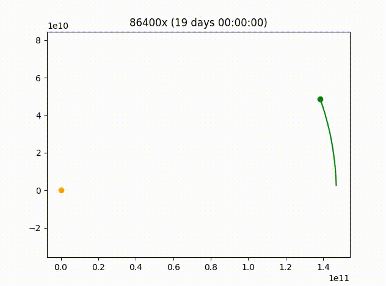

# Orbit Simulator
This project aims to simulate how orbital mechanics work

## Examples
<table cellspacing="0" cellpadding="0">
  <tr>
    <td></td>
    <td></td>
    <td></td>
    <td></td>
  </tr>
  <tr>
    <td>Simple orbit</td>
    <td>Simple orbit with 2 planets</td>
    <td>Orbit with 2 massive objects too close</td>
    <td>Synchronous orbit of 4 planets with different apogee locations</td>
  </tr>
  
</table><br><br>
<table cellspacing="0" cellpadding="0">
  <tr>
    <td ></td>
  </tr>
  <tr>
    <td>3D animation of 3 planets in orbit</td>
  </tr>
</table><br><br>

## Execution
```
usage: orbit_simulator [-h] [-mp PATH_SIZE] [-p] [-d] [-tw TIME_WARP]
                       [-ei EXTRA_ITERATIONS] [-fps FPS] [-3d]
                       preset

positional arguments:
  preset                Simulation preset name

options:
  -h, --help            show this help message and exit
  -mp PATH_SIZE, --path-size PATH_SIZE
                        Maximum amount of path coordinates
  -p, --no-pathes       Disable path drawing
  -d, --direction       Allow direction drawing
  -tw TIME_WARP, --time-warp TIME_WARP
                        Sets time warp
  -ei EXTRA_ITERATIONS, --extra-iterations EXTRA_ITERATIONS
                        Extra interaction per loop. Increases precision.
                        Decreases performance
  -fps FPS, --fps FPS   Sets the frame rate. Decreases performance
  -3d, --3d             Force 3d rendering
```
### Execution Command Example
Run preset ```SYNCHRONOUS_ORBITS``` at 3x time warp, 60 FPS, and force 3d rendering
```
python3 orbit_simulator synchronous_orbits -tw 3 -fps 60 -3d
```

## Measurement Units
Planet mass: $kg$<br>
Distance: $m$<br>
Speed & Velocity: $m/s$<br><br>

## Assumptions and Formulas

### Gravitational Constant
This is an aproximate value of $G$ based on the article "[Precise Ideal Value of the Universal Gravitational Constant G](https://www.scirp.org/journal/paperinformation.aspx?paperid=74770)". By Abed El Karim S. Abou Layla, 2017:<br>
$G= 6.67401 \times 10^{−11} m^3 kg^{−1} s^{−2}$<br><br>

### Distance between planets
In a 2d matrix, planets have $x$ and $y$ coordinates. The formula obtains the distance between the axes of the 2 planets by interpreting it as a right triangle, resulting in the value of the hypotenuse, in meters.

$\sqrt{|x_1-x_2|^{2}+|y_1-y_2|^{2}}$<br>

And for a 3d matrix, you simply need to add the $z$ axis to the formula

$\sqrt{|x_1-x_2|^{2}+|y_1-y_2|^{2}+|z_1-z_2|^{2}}$<br><br>

### Gravitational Acceleration
$G$ = Gravitational Constant<br>
$M$ = Mass of the target planet<br>
$r$ = Distance between the planets<br><br>
$g = {{G*M} \over r^{2}} $<br><br>

### Speed distribution between axes
To calculate the distribution of speed between $x$ and $y$ , you need to calculate how close $x_1$ is from $x_2$ in relation to ($y_1$, $y_2$) and ($z_1$, $z_2$). This calculus will result in a value between $0$ and $1$, it is the proportion of the acceleration of each axis. After that, multiply this value by the acceleration of gravity ($g$) and ($\Delta{t}$).<br>
$g$ = Acceleration of gravity<br>
$\Delta{t}$ = Variation of time<br><br>
$\Delta{x} = g \times { |x_1 - x_2|\over{|x_1 - x_2|+|y_1 - y_2|+|z_1 - z_2|} } \times \Delta{t}$ <br><br>
$\Delta{y} = g \times { |y_1 - y_2|\over{|x_1 - x_2|+|y_1 - y_2|+|z_1 - z_2|} } \times \Delta{t}$ <br><br>
$\Delta{z} = g \times { |z_1 - z_2|\over{|x_1 - x_2|+|y_1 - y_2|+|z_1 - z_2|} } \times \Delta{t}$ <br>

